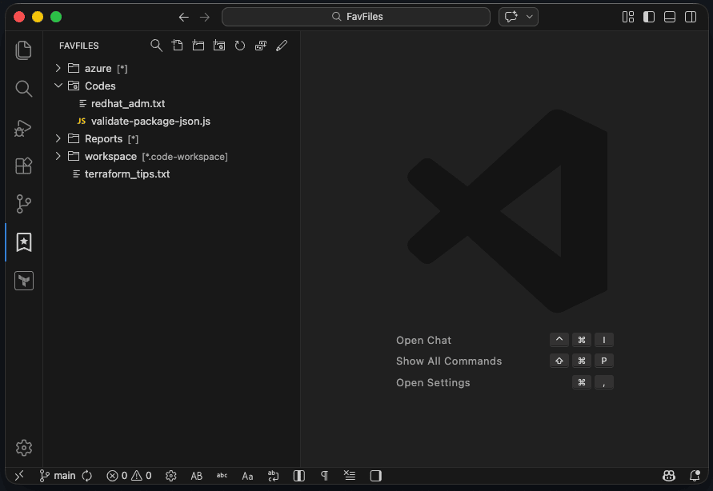

# FavFiles

**FavFiles** is a lightweight Visual Studio Code extension that helps you keep your most-used files and folders in one dedicated sidebar.

Instead of jumping through the Explorer every time, you can pin what matters, organize it into groups, and get back to it in a couple of clicks.

> FavFiles is a maintained fork of [fredjeck/fav](https://github.com/fredjeck/fav), with a reorganized codebase and ongoing improvements.



*Suggested image: a clean hero screenshot showing the FavFiles view with a few groups, files, and folders already organized.*

## Why FavFiles

When you work in large repositories, nested folder structures, or multiple projects, the same files tend to come up again and again. FavFiles gives you a personal shortcut tree inside VS Code so the things you open most often stay close.

FavFiles is useful when you want to:

- keep important files one click away
- bookmark frequently used folders
- organize shortcuts into custom groups
- open several related files from the same group
- keep a personal working set outside the repository structure

## Features

### Pin files you use all the time

Add files from the Explorer, from the active editor, or from the Command Palette.


*Suggested image: add a file from the Explorer context menu and show it appearing in the FavFiles view.*

### Add folders for fast navigation

Save folders to FavFiles and browse them directly from the custom tree without constantly switching back to the Explorer.


*Suggested image: add a folder and expand it inside the FavFiles view.*

### Organize everything into groups

Create groups to structure your favorites by project, environment, customer, workflow, or any system that matches the way you work.

Examples:

- Production
- Daily Work
- Reports
- Customer A
- Infrastructure


*Suggested image: create a group and move files into it.*

### Open related files together

If a group contains multiple files, you can open the whole group at once and restore a working context quickly.


*Suggested image: open a group containing several files.*

### Keep your tree tidy

FavFiles supports renaming, removing, moving items, sorting, and using the native tree filter to quickly find what you saved.


*Suggested image: show the tree filter in use and a tidy grouped structure.*

## How to use

### 1. Open the FavFiles view

Open the FavFiles view from the Activity Bar.


*Suggested image: highlight where the FavFiles icon/view is located in VS Code.*

### 2. Add files or folders

You can add items in different ways:

- right-click a file or folder in the Explorer
- add the currently active file
- use the Command Palette
- use the toolbar actions in the FavFiles view

### 3. Create groups

Use groups to organize your shortcuts into a structure that matches your work.

### 4. Open what you need faster

Open individual files, expand favorite folders, or open an entire group when you want to bring back a full working set.

## Extension Settings

FavFiles currently provides these settings:

### `favFolderTree.sortMode`

Controls how groups and folders are ordered relative to files.

Allowed values:

- `foldersAbove`
- `foldersBelow`
- `mixed`

Default:

```json
"favFolderTree.sortMode": "foldersAbove"
```

### `favFolderTree.sortDirection`

Controls alphabetical ordering in the tree.

Allowed values:

- `asc`
- `desc`

Default:

```json
"favFolderTree.sortDirection": "asc"
```

### Example

```json
{
  "favFolderTree.sortMode": "foldersAbove",
  "favFolderTree.sortDirection": "asc"
}
```

## Requirements

- VS Code 1.51.0 or newer

## Miscellaneous

- FavFiles uses the native VS Code tree filter for quick searching inside the view.
- Favorites are stored in VS Code global storage, so they are not tied to a single workspace.
- The project is distributed under the MIT License.

## Credits and origin

FavFiles is based on the original [Fav](https://github.com/fredjeck/fav) project by Frederic Jecker.

## License

MIT License. See `LICENSE` for details.

## Maintainer notes

Build, packaging, and publishing instructions are intentionally kept out of this README and documented separately in `PUBLISHING.md`.
